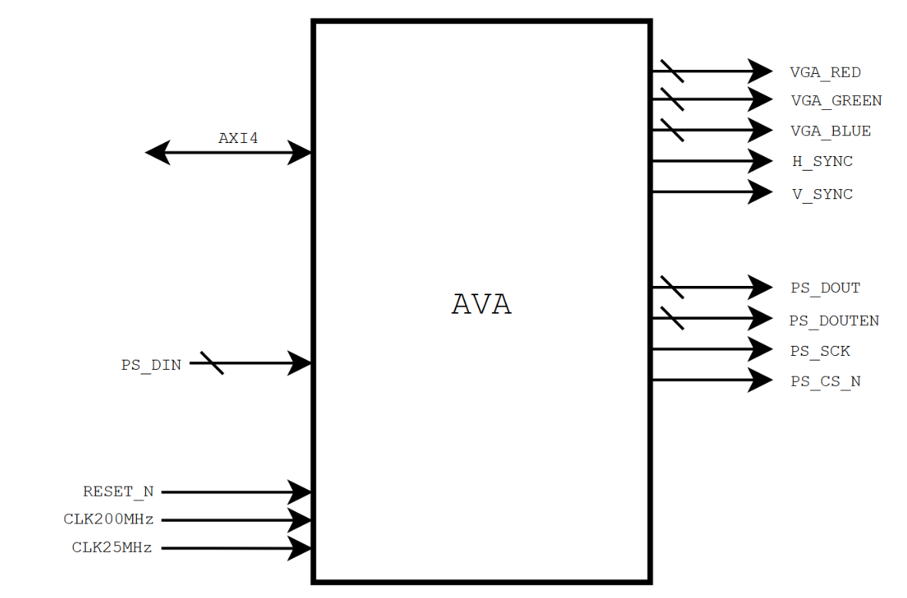
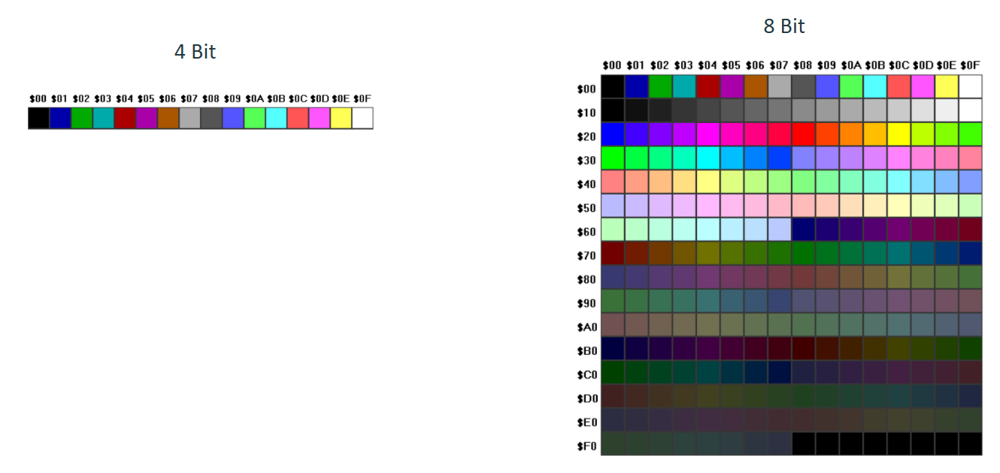
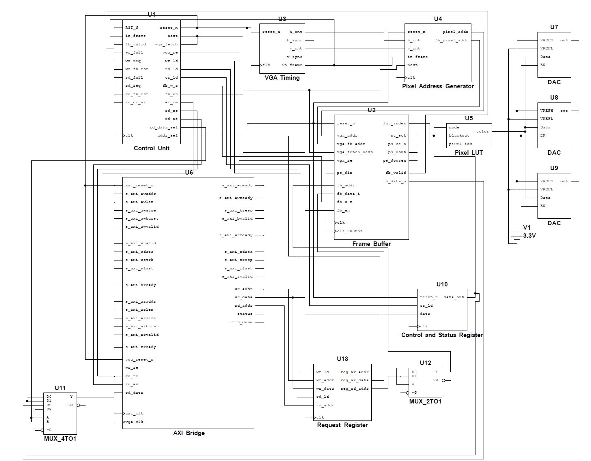
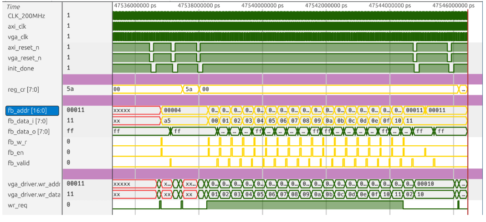
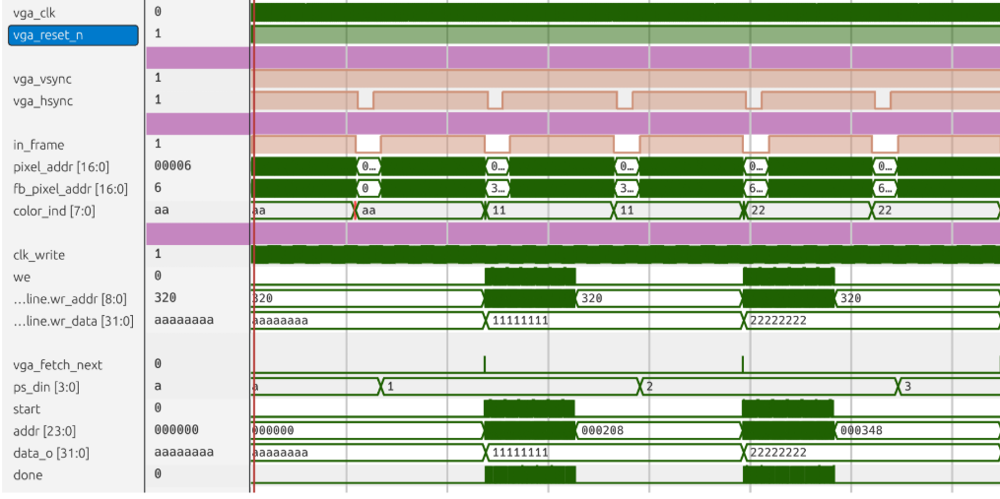
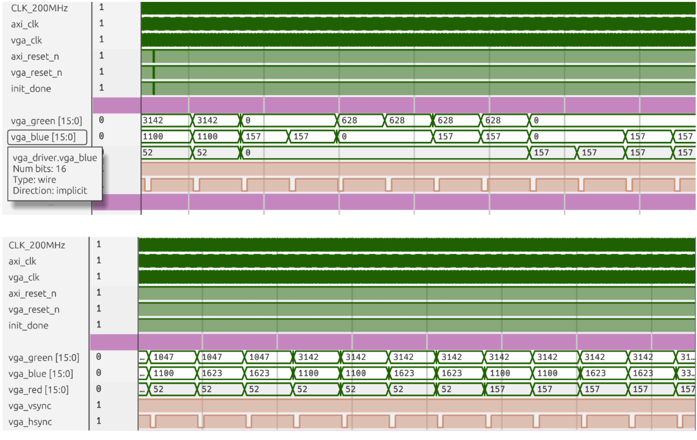

# CPE 470 ASIC Project

### Camille Leute and Danny Gutierrez

https://github.com/efabless/EF_PSRAM_CTRL/tree/main 
https://www.logic-fruit.com/blog/digital-interfaces/axi-full-axi-lite-interfaces/ 

## Who's AVA?

Our final project is an AXI VGA ASIC, or A.V.A. It essentially works as an self contained display engine, so all necessary logic for video display is in one module. It is compatible with standard AXI4 memory mapped bus, and will output VGA signals to a monitor.

## How's AVA?

AVA works by taking in imaging data through the AXI4 bus peripheral. VGA timing will generate the h sync and v sync values, and give location information to the pixel address generator to produce an address for the screen coordinates. This then gets passed onto the framebuffer, which takes the address and data from AXI to generate a LUT index for the color. The LUT index gets passed as an input to the pixel LUT, which has 2 color modes: 16 colors and 256 colors. Based on the mode, this will decide whether it looks at the lower nibble or the full byte when indexing. 

After the 18b correlating color value has been found, that data gets passed to 3 6 bit DACs to generate the analog output value for those colors. 

## Tests

We used icarus verilog to test individual modules, and cocoTB to test all the modules together.

### AXI Transaction Tests

### Line Cache Timing Tests

### Display Tests

## Synthesis

Unfortunate AVA does not synthesize. :(

